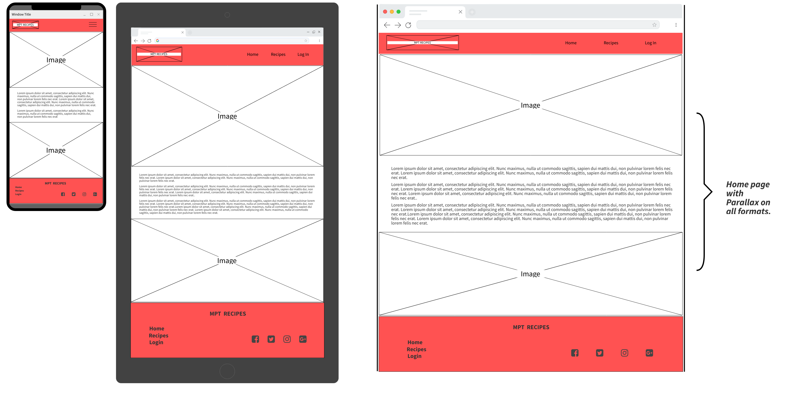
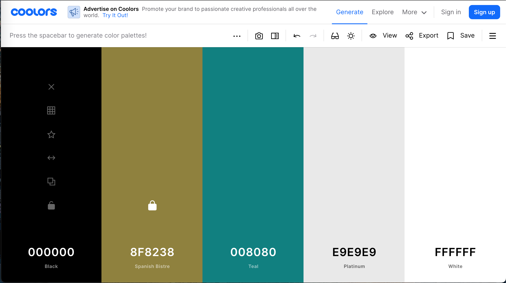

# [MPT Food Recipes](https://)

Third Project for my Diploma Course with the Code Institute, I read a suggestion/idea in the outline section to the milestone project.  As I work as a Personal Trainer I have lots of food recipes and always getting ask about ideas for meals to eat.  Build this site will give me a way of archiving the recipes and allow my clients to see and read them while allowing them to share any recipes or ideas with  other people.

[MPT Food Recipes](https://)

## Table of Content

- [UX Design](#ux-design)
    - [Strategy](#strategy)
    - [Goals](#goals)
- [Design](#design)
    - [Wireframes](#wireframes)
    - [Typography](#Typography)
    - [Color Scheme](#color-scheme)
    - [Image](#image)
- [Features](#features)
    - [Layout](#layout)
    - [Features to implement in the future](#features-to-implement-in-the-future)
- [Technologies used](#technologies-used)
- [Testing](#testing)
- [Deployment](#deployment)
- [Credits](#credits)
    - [Acknowlegements](#acknowlegements)
    - [Inspiration from website](#Inspiration-for-website)
    - [Code](#code)

# UX

## Strategy

MPT Recipes is an online platform to store and present recipe for the user and visitors to the platform. The aim is to deliver inspiration, and share iedas for healthy food recipes.

- build a database of healthy recipes.
- allow people to share ideas of health eating.
- build a community of inspiration.

The owner of the site is looking for a place were clients and like-minded people can share and gather information. For a tool to help the owner with his business and to give the ower's clients an add service.

## Goals

#### Owner goal

- To provide an plaform to share ideas for health recipes.
- To provide a extra service to the owner clients.
- To expand the ower database of recipe and there for expanding the owner's recipes list to offer the owner's clients.

#### User goals

- To get inspiration for eating health.
- To understand what health eathing can look like.
- To build a reptile of go to meal of health life.
- To find meal the whole family can eat.

## **User stories:**

- First time users

    - I want a responsive website that can be access on any one of my devices.
    - I want a easy to follow plaform on which I can easily navigate throught quickly to find the information I want.
    - I want a easy to read recipe page that displays the information clearly.
    - I want a simple sign up page that in be done easily with little to no fuss.
    - I want to be able to search for recipe by name or ingredients.

- Returning users
    
    -  I want a simple page that I can login to and make use of all the features on the platform.
    - I need to be able to add and edit recipe to make profile account.
    - I want a way to contact the owner to ask questions or to make queries about the platform.
    
- Frequent users:

    - I want a way to contact the owner to ask questions or to make queries about the website.
    - I want to be able to search for recipe quickly.
    - I need to be able to add and edit recipe to make profile account.
    - I want a easy way to delete any recipe I no longer feel deemed to be presented on my profile.

## Scope

- Responsive interface.
- Simple menu.
- Simple search function.
- Display search results.
- Login and sign up page.
- A user dashbroad.
- Display recipes / recipe
- Add / edit / delete function of recipes
- A way to contact owner.
- Log out

#### **Functional requirement for the platform.**

- Sign up form with username and password.
- Be able to login
- Be able to view profile page / dashboard.
- Able to run search events by using keywords.
- Display recipe list.
- Displaying a sinlge recipe to use.
- Be able to add / edit / delete a recipe.
- To receive any feedback from important actions on site eg. add / edit / delete recipe.
- Able to contact owner.
- Page 404 Not Found.
- Page 500 Internal Server Error page.

    -  **Future functional for the platform.**

        - Bookmark favorite recipe.
        - Measurement unit converter.
        - Password reset.
        - Rate recipe indicator.
        - View another users porfile.

## Building Constraints

- The owner is building the site for the first time and is still learning Python, Flask, MongoDB and materialize.  If could hinder the owners application to build the overall features on this platform.
- Time: to implementing feature due to learning new technical skills.
  

# Design

A simple site that is moderm and easy on the eye.  Simple to read and easy to follow.

### Wireframes

I used mockup [mockflow.com](https://www.mockflow.com/) 

- [Wireframes Download PDF](https://pdf)
- [Wireframes Download PDF](https://pdf)
- [Wireframes Download PDF](https://pdf)
- [Wireframes Download PDF](https://pdf)
- [Wireframes Download PDF](https://pdf)
- [Wireframes Download PDF](https://pdf)

### Typography

### Color Scheme

I wanted to use teal as my navbar and overall color, with Spanish Bistre as my highlights. Inspiration came from Jamie Olivers website. I wanted a pop of colour and then a clear pallet all the way through the site. 

### Image

# Features

- #### Landing Page or menu

    - A clean inviting page to indicate what site the user is looking at.
    - Simple brake down on the site and how it works.
    - A quickly way to find the recipe you are looking for or the ingredients you are looking to cook with.

- #### Recipe page

    - 

- #### Login /  Sign Up page

    - 

- #### Log Out

    - 

- #### Profile page

    - 

- #### CRAD Features

    - Simple way to add recipes.
        - Ingredients / Method input will need a dynamic table to be able to add and delete list of ingredients which then will be insert into an array in the database.
    - Update recipes.
        - Will need additional table to add further more ingredients and methods.
        - Use of buttons to delete individual ingredients / method from the recipe record file.
        - Alert to check then you want to confirm update of the recipe.
    - Delete recipes.
        - Button to delete the recipe file from the database.
        - A warning alert to check then you want to confirm deletion of the recipe.

- ### Future Features

    - Bookmark favorite recipe.
    - Measurement unit converter.
    - Password reset.
    - Rate recipe indicator.
    - View another users porfile.

# Languages

- [HTML5](https://en.wikipedia.org/wiki/HTML5) 
    - used to structure the page.
- [CSS3](https://en.wikipedia.org/wiki/Cascading_Style_Sheets) 
    - used to add style and look of the page.
- [Javascript](https://en.wikipedia.org/wiki/JavaScript) 
    - used to build interactive elements of the website/page.
- [Python](https://en.wikipedia.org/wiki/Python_(programming_language))
    - Python is an interpreted high-level general-purpose programming language.

# Database

- [MongoDB](https://www.mongodb.com/)
    - MongoDB is a source-available cross-platform document-oriented database program. Classified as a NoSQL database program, MongoDB uses JSON-like documents with optional schemas. 

# Technologies, Libraries and Frameworks Used

- [Materialize](https://materializecss.com/about.html)
    - Materialize is a modern responsive CSS framework based on Material Design by Google.
- [Font Awesome:](https://fontawesome.com/) 
    - a library full of icons.
- [Google Fonts:](https://fonts.google.com/)
    - a library full of fonts.
- [Jquery:](https://en.wikipedia.org/wiki/JQuery) jQuery is a fast, small, and feature-rich JavaScript library.
- [Git:](https://git-scm.com/) 
    - Version control from gitpod, save, commits, and push code to Github.
- [GitHub:](https://github.com/)
    - Live site to save code.
- [GitPod:](https://www.gitpod.io) 
    - Local repository to read the develop code.
- [Heroku](https://www.heroku.com/home)
    - Heroku is a cloud platform as a service supporting several programming languages. One of the first cloud platforms, Heroku has been in development since June 2007
- [JShints](https://jshint.com) 
    - a tool that helps to detect errors and potential.
- [Werkzeug:](https://werkzeug.palletsprojects.com/en/2.0.x/)
    - Werkzeug is a comprehensive WSGI web application library. 
- [Flask:](https://flask.palletsprojects.com/en/2.0.x/)
    -  Flask is an API of Python that allows us to build up web-site.
- [PyMongo:](https://pymongo.readthedocs.io/en/stable/)
    - python library to connect to MongoDB.
- [mockflow.com](https://www.mockflow.com/) 
    - Used to design my wireframes.
- [W3C CSS Validator](https://validator.w3.org) 
    - Used to check of errors in HTML code.
- [W3C HTML Checker](https://validator.w3.org)
    - Used to check of errors in CSS code.
- [Am I responsive](http://ami.responsivedesign.is) 
    - is a high fidelity responsive design tool for previewing your site across a variety of popular devices.
- [W3C Spell Checker](https://www.w3.org/2002/01/spellchecker) 
    - This tool allows you to check the spelling of a web page.
- [Chrome Development Tools](https://developer.chrome.com/docs/devtools/)
    - Web developer tools built directly into the Google Chrome browser. To help developers diagnose problems as they work on projects.
- [Responsive viewer](https://chrome.google.com/webstore/detail/responsive-viewer/inmopeiepgfljkpkidclfgbgbmfcennb?hl=en) 
    - To test your website responsiveness across different devices.
- [Wave Accessibility](https://wave.webaim.org) 
    - helps you make their web content more accessible to different people with disabilities.
- [Google lighthouse](https://developers.google.com/web/tools/lighthouse) 
    - Check your site Performance, Accessibility, Best Practices, and SEO and give it a rating out of a 100.

### Media

- [figma](https://www.figma.com) 

# Testing

## Testing process can be read [here](documentation/testing/).

# Deployment

# Credits

## Inspiration for Website

### Jamie Oliver:
To veiw the site. **[click](https://www.jamieoliver.com/recipes/)**

## Acknowledgments

- My Wife: for her support and looking after the kids.
- My Daughter and Son: For the understand that daddy has to study.
- Previous Mentor: Oluwafemi Medale for helping through the first part of the course.
- New Mentor: Felipe Souza Alarcon for his feedback and help.
- Code Institue: for the knowledge you gave me.
- W3School: For helpful reminders.

## Code

