# [MPT Food Recipes](https://ms3-recipes-site.herokuapp.com/)

This is my third Project for my Diploma Course with the Code Institute. I read  a suggestion/idea in the outline section to the milestone project. As I work as a Personal Trainer I have lots of food recipes and I am always getting asked about ideas for meals to eat. Building this site will give me a way of archiving the recipes and allow my clients to see and read them while allowing them to share any recipes or ideas with other people.

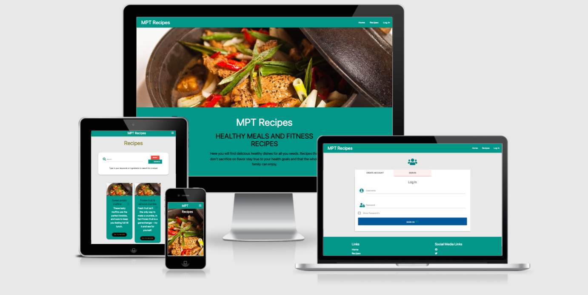
View the site: [MPT Food Recipes](https://ms3-recipes-site.herokuapp.com/)

## Table of Content

- [UX Design](#ux-design)
    - [Strategy](#strategy)
    - [Goals](#goals)
- [Design](#design)
    - [Wireframes](#wireframes)
    - [Typography](#Typography)
    - [Color Scheme](#color-scheme)
    - [Image](#image)
- [Features](#features)
    - [Layout](#layout)
    - [Features to implement in the future](#features-to-implement-in-the-future)
- [Technologies used](#technologies-used)
- [Testing](#testing)
- [Deployment](#deployment)
- [Credits](#credits)
    - [Acknowlegements](#acknowlegements)
    - [Inspiration from website](#Inspiration-for-website)
    - [Code](#code)

# UX

## Strategy

MPT Recipes is an online platform to store and present recipes for the user and visitors to the platform. The aim is to deliver inspiration and share ideas for healthy food recipes.

- build a database of healthy recipes.
- allow people to share ideas of healthy eating.
- build a community of inspiration.

The owner of the site is looking for a place were clients and like-minded people can share and gather information, for a tool to help the owner with his business and to give the owners clients an added service.

## Goals

#### Owner goal

- To provide a platform to share ideas for healthy recipes.
- To provide an extra service to the owner’s clients. 
- To expand the owner database of recipes and therefor for expanding the owner's recipes list to offer to the owner's clients.

#### User goals

- To get inspiration for healthy eating.
- To understand what healthy eating can look like.
- To build a reprepertoire of go to meals for a healthy life.
- To find meal the whole family can eat.

## **User stories:**

- First time users

    - I want a responsive website that can be accessed on any one of my devices.
    - I want a easy to follow platform on which I can easily navigate through quickly to find the information I want.
    - I want an easy to read recipe page that displays the information clearly.
    - I want a simple sign up page that can be done easily with little to no fuss.
    - I want to be able to search for a recipe by name or ingredients.

- Returning users
    
    - I want a simple page that I can login to and make use of all the features on the platform.
    - I need to be able to add and edit recipes to my profile account.
    - I want a way to contact the owner to ask questions or to make queries about the platform.
    
- Frequent users:

    - I want a way to contact the owner to ask questions or to make queries about the website.
    - I want to be able to search for a recipe quickly.
    - I need to be able to add and edit recipes to my profile account.
    - I want an easy way to delete any recipes that I no longer feel deemed to be presented on my profile.

## Scope

- Responsive interface.
- Simple menu.
- Simple search function.
- Display search results.
- Login and sign up page.
- A user dashbroad.
- Display recipes / recipe
- Add / edit / delete function of recipes
- A way to contact owner.
- Log out

#### **Functional requirement for the platform.**

- Sign up form with username and password.
- Be able to login
- Be able to view profile page / dashboard.
- Able to run search events by using keywords.
- Display recipe list.
- Displaying a sinlge recipe to use.
- Be able to add / edit / delete a recipe.
- To receive any feedback from important actions on site eg. add / edit / delete recipe.
- Able to contact owner.
- Page 404 Not Found.
- Page 500 Internal Server Error page.

    -  **Future functional for the platform.**

        - Bookmark favorite recipe.
        - Measurement unit converter.
        - Password reset.
        - Rate recipe indicator.
        - View another users porfile.

## Building Constraints

- The owner is building the site for the first time and is still learning Python, Flask, MongoDB and materialize. The lack of knowledge could hinder me from fulfilling the owners overall look and features on this platform.
- Lack of time: to implement features due to learning new technical skills.

  
## Structure

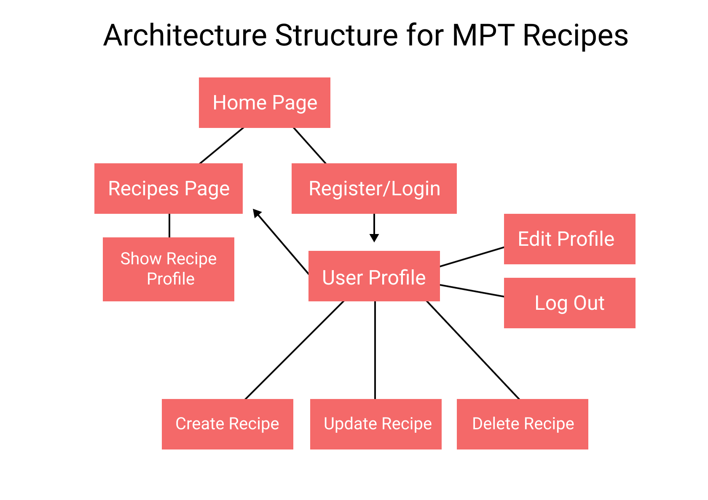

Basic idea for how everything will fix together and move from one page to the next.

# Design

A simple site that is modern and easy on the eye. Simple to read and easy to follow.

### Wireframes

I used mockup [mockflow.com](https://www.mockflow.com/) 

- [Wireframes Download PDF](https://pdf)
- [Wireframes Download PDF](https://pdf)
- [Wireframes Download PDF](https://pdf)
- [Wireframes Download PDF](https://pdf)
- [Wireframes Download PDF](https://pdf)
- [Wireframes Download PDF](https://pdf)

### Database Structure

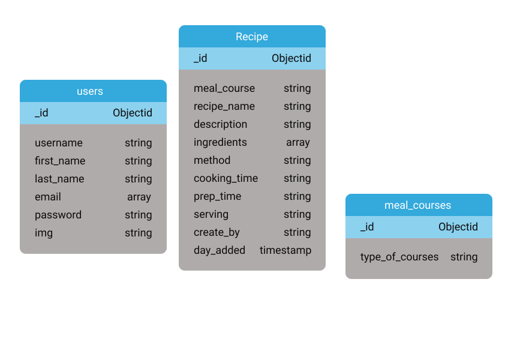

The users image was removed, email became a string and the recipes method was changed to an array.

### Typography

I needed to have a readable font that was easy for anyone to read. A font with clean lines and open and not to forceful. I used ‘Roboto’ and ‘Poppins’ in my first project and I liked how they looked. They have nice flowing lines and they go well together. I used
[Google Fonts](https://fonts.google.com/)

### Color Scheme

I wanted to use teal as my navbar and overall color, with Spanish Bistre as my highlights. Inspiration came from Jamie Olivers website. I wanted a pop of colour and then a clear pallet all the way through the site.

### Image

 [Unsplash](https://unsplash.com/photos/XoByiBymX20) : Photo by [emy](https://unsplash.com/@grimnoire?utm_source=unsplash&utm_medium=referral&utm_content=creditCopyText)

[Unsplash](https://unsplash.com/photos/bpPTlXWTOvg) : Photo by [Caroline Attwood](https://unsplash.com/@carolineattwood?utm_source=unsplash&utm_medium=referral&utm_content=creditCopyText)

# Features

- #### Landing Page or menu

    - A clean inviting page to indicate what site the user is looking at.

    - Simple breakdown on the site and how it works.

    - A quick way to find the recipes you are looking for or the ingredients you are looking to cook with.

    - Collapsible navbar on mobile devices for better visibility.

- #### Recipe page

    - Search bar to quickly find any recipes with the uses of keywords.

    - A clean look to the recipe cards with image, name of the recipe and a short description on the recipe.

    - A icon on the card which will show more information about the recipe as well as button link to the main page showing all the information on the recipe.

- #### Login / Sign Up page

    - Login and sign up is on one page using tabs to switch between each section.

    - A toggle button to show the password to help the users enter the code.

    - On sign up page the user will have to Confirm Password before signing up, this will stop the users entering a different password to the one they think they are entering.

- #### Log Out

    - Once login a log out option will appear in the navbar.

- #### Profile page

    - On the users dashboard / profile page the option to create / update and delete recipes. But only update / delete that the user has created. 

- #### CRAD Features

    - Simple way to add recipes.
        - Ingredients / Method input will need a dynamic table to be able to add and delete list of ingredients which then will be inserted into an array in the database.

    - Update recipes.
        - Will need additional table to add further more ingredients and methods.

        - Use of buttons to delete individual ingredients / method from the recipe record file.

        - Alert to check that you want to confirm the update of the recipe.

    - Delete recipes.

        - Button to delete the recipe file from the database.

        - A warning alert to check that you want to confirm deletion of the recipe.

- #### Footer

    - Have the links to the navbar in the footer.

    - Social Media Links

    - A button linking to a contact us page, so users / visitors can send any questions to the owner of the site.

- ### Future Features

    - Bookmark favorite recipe.
    - Measurement unit converter.
    - Password reset.
    - Rate recipe indicator.
    - View another users porfile.

# Languages

- [HTML5](https://en.wikipedia.org/wiki/HTML5) 
    - used to structure the page.
- [CSS3](https://en.wikipedia.org/wiki/Cascading_Style_Sheets) 
    - used to add style and look of the page.
- [Javascript](https://en.wikipedia.org/wiki/JavaScript) 
    - used to build interactive elements of the website/page.
- [Python](https://en.wikipedia.org/wiki/Python_(programming_language))
    - Python is an interpreted high-level general-purpose programming language.

# Database

- [MongoDB](https://www.mongodb.com/)
    - MongoDB is a source-available cross-platform document-oriented database program. Classified as a NoSQL database program, MongoDB uses JSON-like documents with optional schemas. 

# Technologies, Libraries and Frameworks Used

- [Materialize](https://materializecss.com/about.html)
    - Materialize is a modern responsive CSS framework based on Material Design by Google.
- [Font Awesome:](https://fontawesome.com/) 
    - a library full of icons.
- [Google Fonts:](https://fonts.google.com/)
    - a library full of fonts.
- [Jquery:](https://en.wikipedia.org/wiki/JQuery) jQuery is a fast, small, and feature-rich JavaScript library.
- [Git:](https://git-scm.com/) 
    - Version control from gitpod, save, commits, and push code to Github.
- [GitHub:](https://github.com/)
    - Live site to save code.
- [GitPod:](https://www.gitpod.io) 
    - Local repository to read the develop code.
- [Heroku](https://www.heroku.com/home)
    - Heroku is a cloud platform as a service supporting several programming languages. One of the first cloud platforms, Heroku has been in development since June 2007
- [JShints](https://jshint.com) 
    - a tool that helps to detect errors and potential.
- [Werkzeug:](https://werkzeug.palletsprojects.com/en/2.0.x/)
    - Werkzeug is a comprehensive WSGI web application library. 
- [Flask:](https://flask.palletsprojects.com/en/2.0.x/)
    -  Flask is an API of Python that allows us to build up web-site.
- [PyMongo:](https://pymongo.readthedocs.io/en/stable/)
    - python library to connect to MongoDB.
- [mockflow.com](https://www.mockflow.com/) 
    - Used to design my wireframes.
- [RandomKeygen](https://randomkeygen.com/)
    - RandomKeygen is a free mobile-friendly tool that offers randomly generated keys and passwords you can use to secure any application, service or device.
- [W3C CSS Validator](https://validator.w3.org) 
    - Used to check of errors in HTML code.
- [W3C HTML Checker](https://validator.w3.org)
    - Used to check of errors in CSS code.
- [Am I responsive](http://ami.responsivedesign.is) 
    - is a high fidelity responsive design tool for previewing your site across a variety of popular devices.
- [W3C Spell Checker](https://www.w3.org/2002/01/spellchecker) 
    - This tool allows you to check the spelling of a web page.
- [Chrome Development Tools](https://developer.chrome.com/docs/devtools/)
    - Web developer tools built directly into the Google Chrome browser. To help developers diagnose problems as they work on projects.
- [Responsive viewer](https://chrome.google.com/webstore/detail/responsive-viewer/inmopeiepgfljkpkidclfgbgbmfcennb?hl=en) 
    - To test your website responsiveness across different devices.
- [Wave Accessibility](https://wave.webaim.org) 
    - helps you make their web content more accessible to different people with disabilities.
- [Google lighthouse](https://developers.google.com/web/tools/lighthouse) 
    - Check your site Performance, Accessibility, Best Practices, and SEO and give it a rating out of a 100.

### Media

- [figma](https://www.figma.com) 

# Testing User Stories

- ## User Stories Testing can be read [here](documentation/testing/testing-doc/storiestesting.md).

# Testing

- ## Testing process can be read [here](documentation/testing/testing-doc/testing.md).

# Deployment

Repository is hosted on Github and deployed on Heroku. I developed the website using the Code Institute template on Gitpod, and push to GitHub by the uses of the Gitpod terminal.

### Other platforms used

- An account with MongoDB.
- An account with Heroku.

## Cloning the Project

When you finish logging into Github, navigate to the repository page, and select MS3-recipes. Above the file list, click on the Code button next to the Gitpod button (green button). Copy the URL. Open your terminal. Change the working directory to the location where you want the cloned directory. Paste the URL after you have type git clone. eg $ git clone https://github.com/Username/repository-name Press enter and this will create a local clone.

Or 

## Download zip files

Create a repository in GitHub. Unzip the folder Upload the files into your workspace You can read more about this in the link below.

More information on cloning repository:
[Github Information](https://docs.github.com/en/github/creating-cloning-and-archiving-repositories/cloning-a-repository)

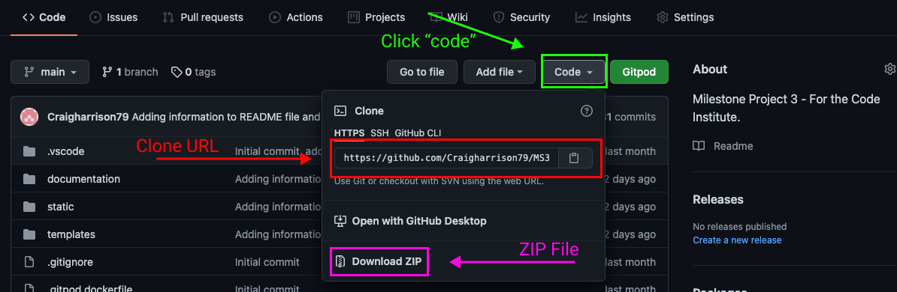

## Forking the Project

When you finish logging into Github, navigate to the repository page, and select MS3-MPT-Recipes. At top right of the page click on the fork button.

More information on fork repository:
[Github Information](https://docs.github.com/en/github/getting-started-with-github/fork-a-repo)

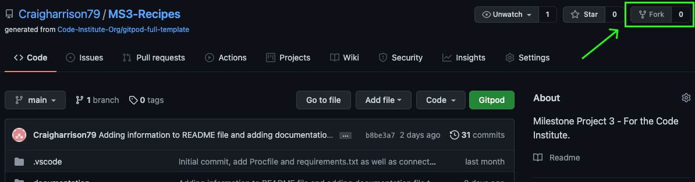

## Get connection to MongoDB

- Click on project

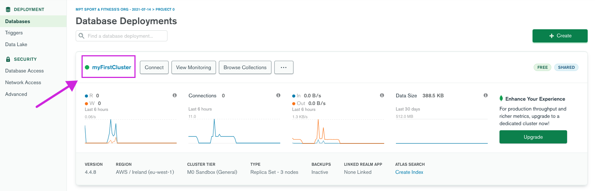

- Click on connect

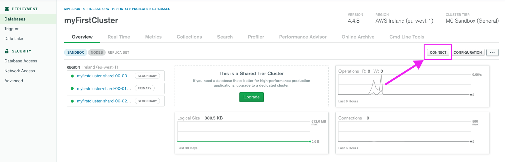

- Select connect your application

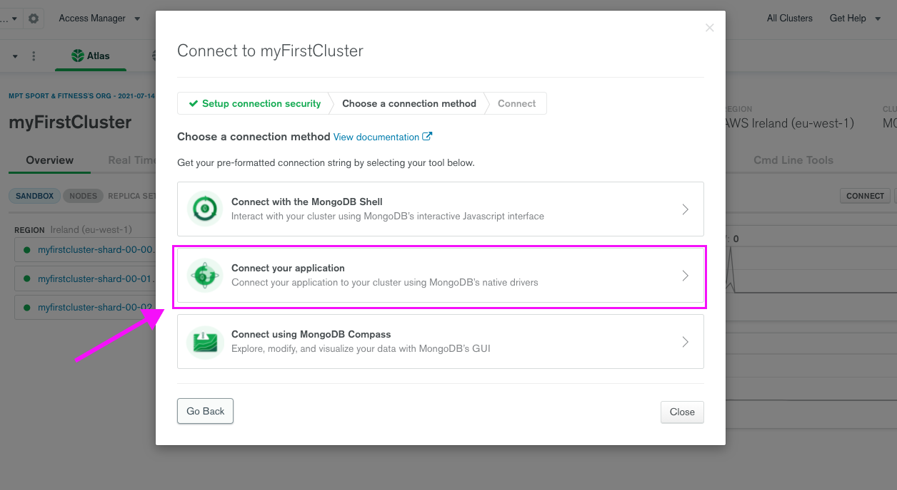

- Make sure you pick Driver: Python, Version: 3.6 or later.

- Replace password with the password for the root user. Replace myFirstDatabase with the name of the database that connections will use by default.

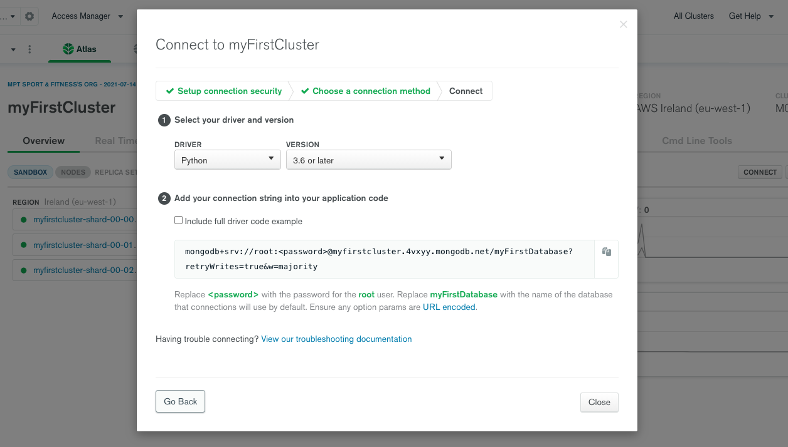

## Set up the local environment

- In the command line create a file "env.py" by entering touch env.py.

- Add the following to this file.

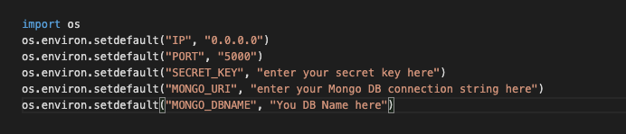

- Add both the env.py and pycache/ to gitignore.

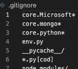

## Procfile and Requirements.txt

- We need to make a list of all the Python dependencies for the project which can be done in the command line by creating a file "requirements.txt.

``$ pip freeze > requirements.txt`` 

- When we deploy to Heroku we need a specific file that lets Heroku know how to run the project and this is done in the command line also by creating a Profile.

``$ echo web: python app.py > Procfile`` (use capital P when writing Procfile).

- Also make sure you remove any added lines to the Procfile code as this can cause problems in Heroku running the project.

- How push to GitHub.

## Deployment on Heroku

Log onto Heroku and to create an app by clicking on the new app button.

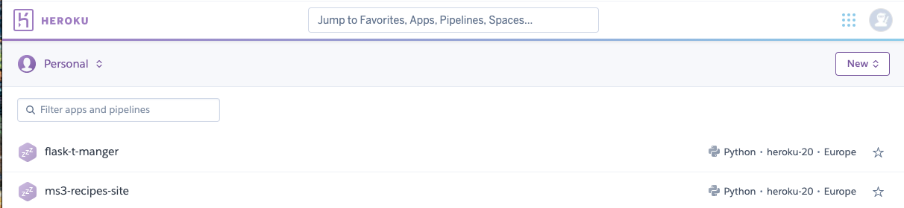

- You need to a unique name for your application.
 
- Now select the region that is closest to you.

- Set your deployment method to 'GitHub'.

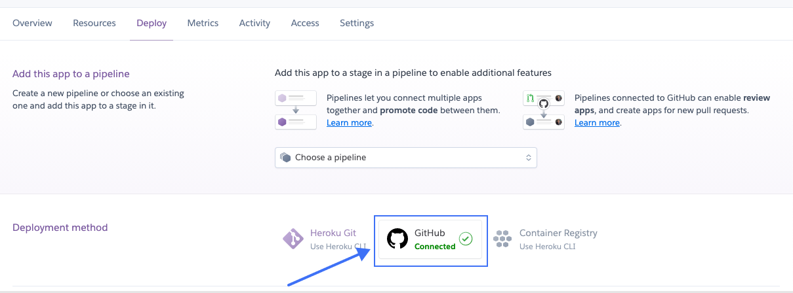

- Find the repository that you are going to deploy.

- Enable automatic deploy.

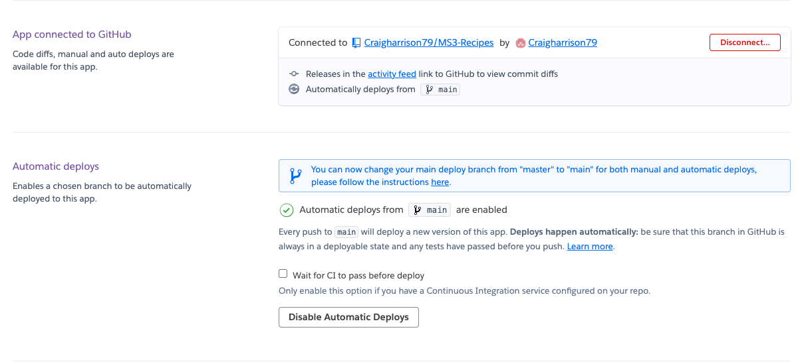

- To Set environment in Heroku App

    - Go to settings, In the config vars click show config vars.
    - Enter your key value pairs as per your env.py file.

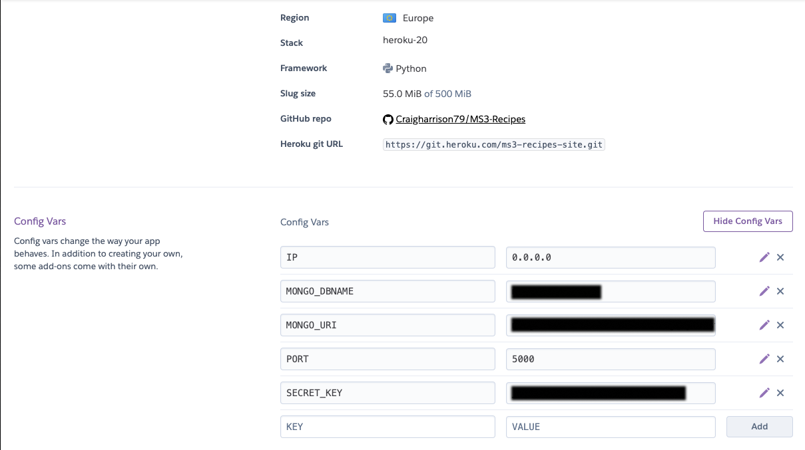

# Credits

[CodeInstitue](https://github.com/Craigharrison79/FlaskFramework) : contact us form

[CodeInstitue](https://github.com/Craigharrison79/TaskManager-project) : template of the site, and code!

## Inspiration for Website

### Jamie Oliver:
To veiw the site. **[click](https://www.jamieoliver.com/recipes/)**

## Acknowledgments

- My Wife: for her support and looking after the kids.
- My Daughter and Son: For the understand that daddy has to study.
- Previous Mentor: Oluwafemi Medale for helping through the first part of the course.
- New Mentor: Felipe Souza Alarcon for his feedback and help.
- Code Institue: for the knowledge you gave me.
- W3School: For helpful reminders.

## Code

#### Java Script

[Stackoverflow](https://stackoverflow.com/questions/33513557/delete-dynamically-created-rows-in-javascript): add / delete dynamically created rows in javascript

[Stackoverflow](https://stackoverflow.com/questions/33513557/delete-dynamically-created-rows-in-javascript) : add / delete dynamically created rows in javascript

[etutorialspoint](https://www.etutorialspoint.com/index.php/11-dynamically-add-delete-html-table-rows-using-javascript) : Dynamically Add/Delete HTML Table Rows Using Javascript

[w3schools](https://www.w3schools.com/howto/tryit.asp?filename=tryhow_js_toggle_password) : password toggle

[Stackoverflow](https://stackoverflow.com/questions/59187988/how-do-i-toggle-password-visibility) : password toggle

[CodeInstitue](https://github.com/Craigharrison79/TaskManager-project) : category selection

[Materializecss](https://materializecss.com/): Java Script code

#### Python code

[pythonhosted](https://pythonhosted.org/Flask-Mail/) : Flask mail

[Pretty Printed](https://www.youtube.com/watch?v=48Eb8JuFuUI&t=944s) : Flask mail

[Stackoverflow](https://stackoverflow.com/questions/65434221/prevent-users-from-directly-accessing-url-and-redirect-to-login-if-not-logged-in) : Prevent users from directly accessing url.

Login decorators : 

